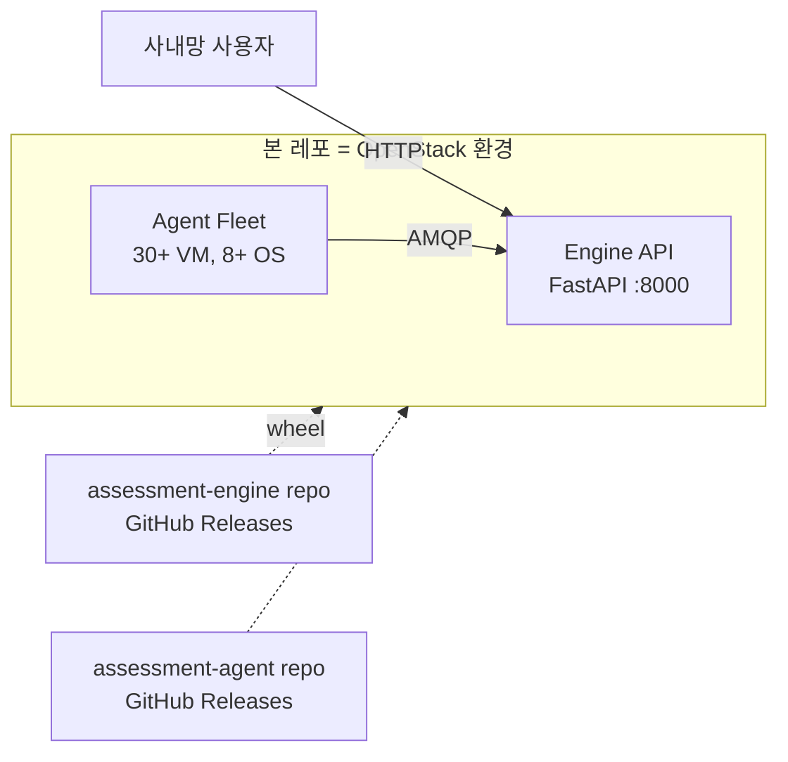

# 시스템 개요

## 무엇을 만드는가

assessment-engine(평가·진단 시스템) + assessment-agent(C 바이너리 모니터링 에이전트)의 **OpenStack 배포 인프라**.

본 레포는 **인프라만** 담당 — 기능 코드는 assessment-engine repo에서 wheel·바이너리 형태로 가져옴.

## 시스템 컨텍스트 (C4 Level 1)

## 본 레포가 만드는 것

- **엔진 컴포넌트 VM 6종** (API·MQ·Cache·DB·Worker·AI) — 단일 인스턴스, Docker 없이 직접 설치 (ADR-0003)
- **Agent 테스트 플릿** (30대+·OS 8종+) — 멀티 OS 동작 검증
- **네트워크 격리** — engine-subnet / agent-subnet 분리, SG로 컴포넌트별 접근 제어
- **운영 자산** — Cinder 볼륨 (MQ·DB), FIP (API), Ansible Vault (secret)

## 본 레포가 만들지 않는 것

- Neutron network·subnet·router — Horizon 수동 (`data` source로 참조만)
- OpenStack keypair — Horizon 등록분 (`variable`로 참조만)
- Bastion VM — Horizon 수동 (첫 ops host)
- 기능 코드 — assessment-engine / assessment-agent repo의 release artifact

## 외부 의존 contract

assessment-engine repo의 자산을 본 레포가 참조한다. 카탈로그·schema는 외부 단일 진실.

| 자산 | 위치 | 용도 |
|---|---|---|
| engine 환경변수 카탈로그 | 본 레포 `docs/operations/env-engine.md` | engine VM inject할 키 목록 |
| agent 환경변수 카탈로그 | 본 레포 `docs/operations/env-agent.md` | agent VM inject할 키 목록 |
| prod contract | assessment-engine `docs/operations/prod-contract.md` | secret 채널·weak default 거부 정책 |
| 메시지 schema | assessment-engine `docs/architecture/agent.md` | agent ↔ broker 페이로드 |
| 디렉토리 구조 ref | assessment-engine `docs/ref/cd-repo-guide.md` + `agent-fleet-infra-guide.md` | 본 레포 디자인 ref (격리) |
| release artifact | assessment-engine `docs/operations/release.md` | wheel·sdist·SHA256SUMS 다운로드 |
| 배포 단계 | assessment-engine `docs/operations/deployment.md` | install·systemd 절차 |

## 도구 파이프라인

0. **Horizon** (웹 UI) — network·subnet·router·bootstrap VM·keypair 수동 생성
1. **Terraform** (bastion) — SG·VM·port·volume·FIP 관리
2. **Ansible** (bastion) — 패키지 설치·Cinder 마운트·wheel/바이너리 배포·systemd 등록

세부 단계: [`docs/setup.md`](../setup.md).

## 환경 제약 (폐쇄망)

- `ppa1.rabbitmq.com` (Cloudsmith) 차단 → RabbitMQ는 Debian main repo (ADR-0004)
- TimescaleDB는 `postgresql-16 >= 16.14` 요구 → PGDG repo 필수 (`trixie-pgdg`)
- VM은 외부 인터넷 직접 접근 불가 → wheel·바이너리는 bastion에서 다운로드 후 Ansible files 디렉토리에 사전 복사
