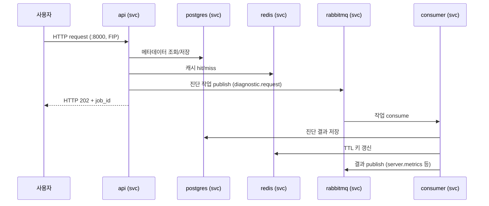
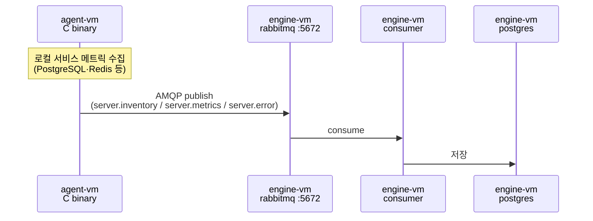
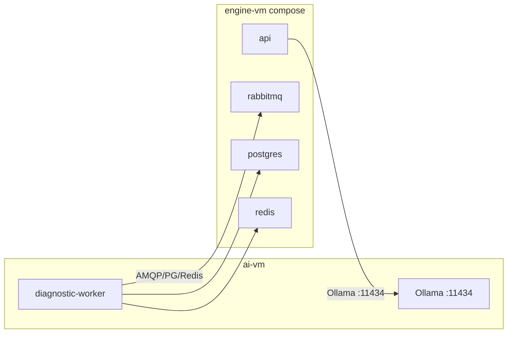

# 런타임 동작

실행 시점의 흐름만. 정적 구조는 [topology.md](topology.md), 컴포넌트 책임은 [components.md](components.md).

> ADR-0010 이후 engine 컴포넌트(api·consumer·postgres·rabbitmq·redis)는 **engine-vm 한 대의 docker compose 서비스**다. 아래 흐름의 컴포넌트 간 통신은 별도 명시가 없으면 **같은 호스트 내 컨테이너 네트워크**에서 일어난다.

## 메시지 흐름 — Engine 내부 (engine-vm compose 서비스 간)



## 메시지 흐름 — Agent → Engine



> agent → engine 경로만 SG(engine-sg 5672 ← agent-sg)를 탄다. 메시지 schema는 assessment-engine repo `docs/architecture/agent.md` 단일 진실.

## AI VM 흐름



- **Ollama**: LLM 추론 데몬. engine의 api/worker가 narrative 합성 시 `:11434` 호출 (engine-sg → ai-sg)
- **diagnostic-worker**: AI VM에서 도는 compose 서비스 — engine의 MQ/Postgres/Redis로 역방향 접속 (ai-sg → engine-sg 5672·5432·6379)
- AI VM 분리 이유: GPU/메모리 요구·모델 disk(100 GB)·lifecycle이 engine stack과 상이 (ADR-0010)

## 환경변수 주입 파이프라인 (Ansible 단계)

```
[소스]                          [처리]                    [주입]

Ansible Vault                ┐
  vault.yml (암호화)          │  ansible-playbook         compose_dir/.env
  → vault_db_password 등     │  실행 시 Jinja2 렌더링     (mode 0600)
                              ├──────────────────────►          │
group_vars/all/               │  engine_compose role            │ docker compose
  common.yml · engine.yml     │  templates/.env.j2              ▼
  (+ ghcr_token extra-var)     │                          각 서비스 컨테이너 env
                              │                          (compose env_file)
inventory hostvars            ┘
  ansible_host (각 VM IP)
```

**경로:**
- 템플릿: `engine/ansible/roles/engine_compose/templates/.env.j2` (구 `app.env.j2`·`zdm.yml` 통합)
- compose 정의: release artifact의 `docker-compose.yml` (bastion이 받아 engine-vm `compose_dir`로 복사)
- 변수 선언: `engine/ansible/group_vars/all/vault.yml.example`

**환경변수 키 목록**: 본 문서는 주입 메커니즘만. 어떤 키가 어디로 들어가는지는 `docs/operations/env-engine.md` / `env-agent.md` 참조.

## 배포 시 흐름

### Engine compose 배포 (release 자동화 — ADR-0011)

```
assessment-engine release 발행
        │ repository_dispatch (engine_version)
        ▼
self-hosted runner (bastion)
        │ terraform apply  → engine-vm·ai-vm·SG·volume·FIP
        │ gen_inventory.py --scope engine
        ▼
ansible-playbook playbook-engine.yml
        │ ① docker-ce 설치 + Cinder mkfs/mount(/mnt/pgdata,/mnt/mqdata)
        │ ② release의 docker-compose.yml·env.example 다운로드
        │    (bastion이 delegate_to:localhost로 대신 받음) → engine-vm compose_dir
        │ ③ .env.j2 렌더 (vault secret inject)
        │ ④ docker compose pull (GHCR/docker.io 이미지)
        │ ⑤ docker compose up -d  (migrate init-container → api·consumer·pg·mq·redis)
        ▼
ansible-playbook playbook-ai.yml  (Ollama + diagnostic-worker)
```

- release URL은 `engine_release_base_url`(= `.../releases/download/v{{ engine_version }}`) — **태그에 `v` 접두사** 필수
- 수동 재트리거: `gh api repos/:owner/:repo/dispatches -f event_type=engine-release -F client_payload[engine_version]=X.Y.Z`
- 현장 appliance: `playbook-field.yml`(`ansible_connection=local`) + 이미지 tar `docker load` (ADR-0011, 별도 문서)

### Agent 바이너리 배포

```
GitHub Releases ─ binary 다운로드 ─► bastion
                                        │
                                        ▼
                            agent/ansible/files/binaries/
                            ├── assessment-agent-linux
                            └── assessment-agent.exe
                                        │
                                        │ ansible-playbook playbook-agent.yml
                                        ▼
                              agent-vm (OS별 분기)
```

| OS 계열 | 바이너리 | 배포 채널 |
|---|---|---|
| Linux (Debian·Ubuntu·CentOS·RHEL 등) | `assessment-agent-linux` | SSH + Ansible copy |
| Windows | `assessment-agent.exe` | WinRM (5985) |

### Alembic 마이그레이션

- compose의 **`migrate` init-container**로 실행 — `docker compose up` 시 1회, api/consumer는 `depends_on: condition: service_completed_successfully`로 대기
- 구모델의 `playbook-api.yml` alembic one-shot task는 폐기 (ADR-0010)

## 장애 시나리오

engine 컴포넌트는 모두 같은 VM의 컨테이너 — `restart: unless-stopped` + `healthcheck`로 컨테이너 단위 자가 복구.

| 장애 | 영향 | 복구 |
|---|---|---|
| redis 컨테이너 다운 | fail-open — 캐시 미스만, 서비스 유지 | `docker compose restart redis` (자동 재시작) |
| rabbitmq 컨테이너 다운 | publish/consume 정지. 큐는 mnesia(/mnt/mqdata)에서 복구 | 자동 재시작 + 볼륨 점검 |
| postgres 컨테이너 다운 | 전체 서비스 중단 | 자동 재시작, `/mnt/pgdata` 마운트 점검 |
| consumer 컨테이너 다운 | 진단 작업 적체 — API 응답엔 영향 X | 자동 재시작 |
| **engine-vm 자체 다운** | 전체 engine stack 중단 (단일 노드 SPOF — 2개월 short-lived라 수용, ADR-0010) | VM 재기동 → `systemctl`/compose 자동 up |
| ai-vm 다운 | LLM narrative 합성 + AI diagnostic-worker만 영향 | Ollama/compose restart |
| agent-vm 다운 | 해당 VM 수집 정지. 다른 agent·engine 영향 X | systemd restart |
