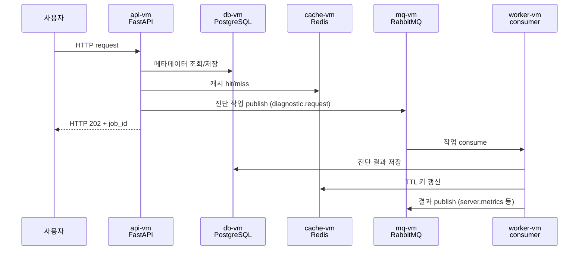
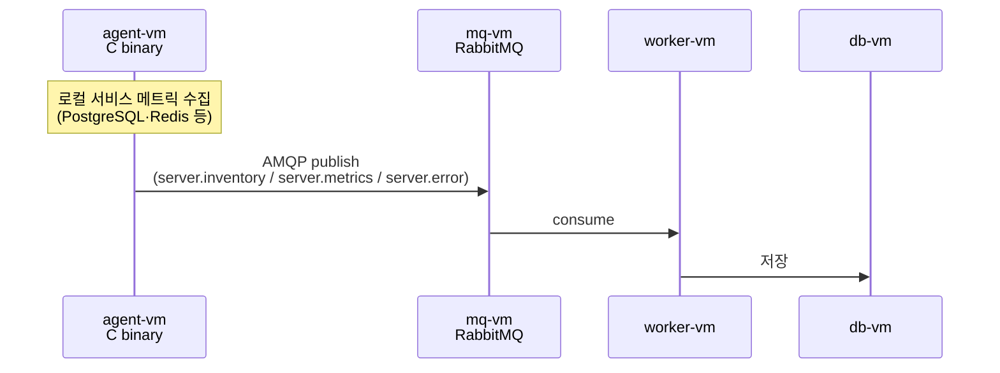
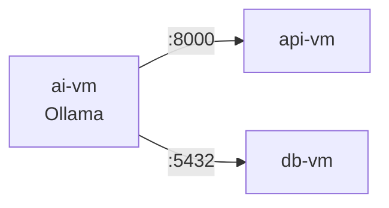

# 런타임 동작

실행 시점의 흐름만. 정적 구조는 [topology.md](topology.md), 컴포넌트 책임은 [components.md](components.md).

## 메시지 흐름 — Engine 내부



## 메시지 흐름 — Agent → Engine



> 메시지 schema는 assessment-engine repo `docs/architecture/agent.md` 단일 진실.

## AI VM 흐름



- AI VM은 API/DB로 능동 호출하는 **클라이언트 측**
- Python wheel 없음 — Ollama 데몬 + 최경량 모델(~3B Q4) 로컬 실행
- 100 GB disk로 모델 저장

## 환경변수 주입 파이프라인 (Ansible 단계)

```
[소스]                          [처리]                  [주입]

Ansible Vault                ┐
  vault.yml (암호화)          │  Ansible 실행 시        systemd
  → vault_db_password 등     │  Jinja2 렌더링          EnvironmentFile=
                              ├────────────────────►   /opt/assessment/
group_vars/all/               │   app.env.j2            <service>.env
  common.yml                  │  (template 모듈)        (mode 0600)
  engine.yml                  │                              │
  zdm.yml                     │                              ▼
                              │                         프로세스 env
inventory hostvars            │                         (systemd 기동)
  ansible_host (각 VM IP)    ┘
```

**경로:**
- 템플릿: `engine/ansible/roles/app/templates/app.env.j2`
- systemd unit: `engine/ansible/roles/app/templates/app.service.j2`
- 변수 선언: `engine/ansible/group_vars/all/vault.yml.example`

**환경변수 키 목록**: 본 문서는 주입 메커니즘만. 어떤 키가 어디로 들어가는지는 `docs/operations/env-engine.md` / `env-agent.md` 참조.

## 배포 시 흐름

### Engine wheel 배포 (Option A — CI 무관)

```
GitHub Releases ─ wheel 다운로드 ─► bastion
                                       │
                                       │ 수동 복사
                                       ▼
                            engine/ansible/files/wheels/
                                       │
                                       │ ansible-playbook playbook-api.yml
                                       ▼
                                  api-vm / worker-vm
                                  /tmp/release/  →  venv pip install
```

1. bastion에서 GitHub Releases의 wheel 다운로드
2. `engine/ansible/files/wheels/`에 복사
3. `engine/ansible/group_vars/all/engine.yml`의 `engine_version` 갱신
4. `playbook-api.yml` 또는 `playbook-worker.yml` 실행

### Agent 바이너리 배포

```
GitHub Releases ─ binary 다운로드 ─► bastion
                                        │
                                        ▼
                            agent/ansible/files/binaries/
                            ├── assessment-agent-linux
                            └── assessment-agent.exe
                                        │
                                        │ ansible-playbook playbook-agent.yml
                                        ▼
                              agent-vm (OS별 분기)
```

| OS 계열 | 바이너리 | 배포 채널 |
|---|---|---|
| Linux (Debian·Ubuntu·CentOS·RHEL 등) | `assessment-agent-linux` | SSH + Ansible copy |
| Windows | `assessment-agent.exe` | WinRM (미구현) |

### Alembic 마이그레이션

- `playbook-api.yml`만 `app_run_alembic: true`로 실행
- ExecStart가 아니라 Ansible task로 one-shot — 배포 시점에만
- `_migrations/` → `migrations/` symlink 생성 후 `alembic upgrade head`

## 장애 시나리오

| 장애 | 영향 | 복구 |
|---|---|---|
| cache-vm 다운 | fail-open — 캐시 미스만 발생, 서비스 유지 | redis-server restart |
| mq-vm 다운 | 진단 작업 publish/consume 정지. 누적된 큐는 mnesia(Cinder)에서 복구 | rabbitmq-server restart |
| db-vm 다운 | 전체 서비스 중단 | postgresql restart, Cinder 마운트 점검 |
| worker-vm 다운 | 진단 작업 대기 (큐에 적체) — API 응답엔 영향 X | systemd restart |
| ai-vm 다운 | LLM 진단 narrative 합성만 영향 | Ollama restart |
| agent-vm 다운 | 해당 VM의 메트릭 수집 정지. 다른 agent·engine은 영향 X | systemd restart |
