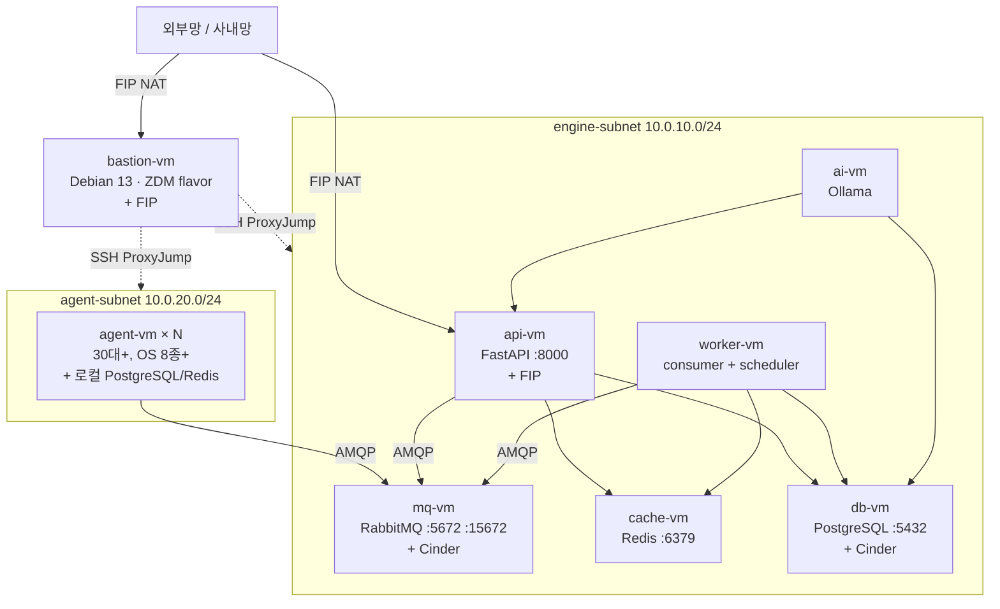

# 토폴로지

정적 배치(네트워크·VM·SG). 런타임 흐름은 [runtime.md](runtime.md).

## 네트워크 구조

| 자원 | 범위 / 정의 | 관리 주체 |
|---|---|---|
| Neutron network | private network 1개 | Horizon 수동 |
| engine-subnet | `10.0.10.0/24` — 엔진 컴포넌트 VM | Horizon 수동 |
| agent-subnet | `10.0.20.0/24` — Agent VM | Horizon 수동 |
| Router | External Gateway + 두 subnet에 internal interface | Horizon 수동 |
| Floating IP — API VM | 외부망 노출 | Terraform (`engine/terraform/floating_ips.tf`) |
| Floating IP — Bastion | 사내망 SSH 접근 | Horizon 수동 |

> 보안 격리는 Subnet이 아닌 **Security Group**으로 강제 (subnet은 IP 관리·조직화 목적).

## VM 배치

## Security Group 매트릭스

SG 8종 — `bastion-sg`(Horizon 등록·data 참조) + 본 레포 생성 7종(api·mq·cache·db·worker·agent·ai).

### Remote SG 참조 (`remote_group_id` 방식)

| Source SG | Port | Target SG | 용도 |
|---|---|---|---|
| bastion-sg | 22 | api·mq·cache·db·worker·agent·ai | SSH 관리 |
| api-sg | 5672 | mq-sg | AMQP publish |
| api-sg | 15672 | mq-sg | Management UI |
| api-sg | 6379 | cache-sg | Redis |
| api-sg | 5432 | db-sg | PostgreSQL |
| worker-sg | 5672 | mq-sg | AMQP consume |
| worker-sg | 15672 | mq-sg | Management UI |
| worker-sg | 6379 | cache-sg | Redis |
| worker-sg | 5432 | db-sg | PostgreSQL |
| agent-sg | 5672 | mq-sg | AMQP publish (agent → engine) |
| ai-sg | 8000 | api-sg | API 호출 |
| ai-sg | 5432 | db-sg | DB 직접 조회 |

### IP-prefix 기반 규칙 (`remote_ip_prefix` 방식)

| Source | Port | Target | 비고 |
|---|---|---|---|
| `var.internal_cidr` (기본 `0.0.0.0/0`) | 8000 | api-sg | API 외부 노출 (FIP) |
| agent-subnet CIDR | ALL | agent-sg | agent 간 자유 통신 |

> Egress는 OpenStack SG 기본값(전체 허용) 그대로 사용 — 별도 규칙 없음.

## Cinder 볼륨 매핑

| VM | 디바이스 | 마운트 포인트 | 크기 | 용도 |
|---|---|---|---|---|
| mq-vm | `/dev/vdb` | `/var/lib/rabbitmq` | TBD | RabbitMQ mnesia |
| db-vm | `/dev/vdb` | `/var/lib/postgresql` | TBD | PostgreSQL data |

> 볼륨 크기는 학습 환경 데이터량 기준 산정 — 결정 보류 (CLAUDE.md 보류된 결정 참조).

## 다이어그램 파일

- `diagrams/topology.svg` — 전체 토폴로지 (시각화 export)
- 위 Mermaid 소스가 단일 진실, SVG는 결과물

## 변경 시 갱신 위치

| 변경 종류 | 갱신 파일 |
|---|---|
| 서브넷 CIDR | `engine/terraform/variables.tf` + 본 문서 |
| 새 VM 추가 | `engine/terraform/instances.tf` + 본 문서 + components.md |
| SG 규칙 | `engine/terraform/security_groups.tf` + 본 문서 매트릭스 |
| Cinder 볼륨 | `engine/terraform/volumes.tf` + 본 문서 |
