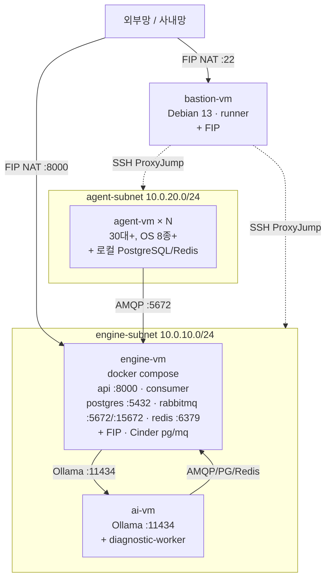

# 토폴로지

정적 배치(네트워크·VM·SG). 런타임 흐름은 [runtime.md](runtime.md).

## 네트워크 구조

| 자원 | 범위 / 정의 | 관리 주체 |
|---|---|---|
| Neutron network | private network 1개 | Horizon 수동 |
| engine-subnet | `10.0.10.0/24` — engine·AI VM | Horizon 수동 |
| agent-subnet | `10.0.20.0/24` — Agent VM | Horizon 수동 |
| Router | External Gateway + 두 subnet에 internal interface | Horizon 수동 |
| Floating IP — engine-vm | API(:8000) 외부망 노출 | Terraform (`engine/terraform/floating_ips.tf`) |
| Floating IP — Bastion | 사내망 SSH 접근 | Horizon 수동 |

> 보안 격리는 Subnet이 아닌 **Security Group**으로 강제 (subnet은 IP 관리·조직화 목적).

## VM 배치

ADR-0010으로 engine stack은 **단일 VM의 docker compose**로 통합. AI VM만 별도 유지.

> engine 내부(api↔pg/mq/redis/consumer) 통신은 **같은 호스트 loopback** — SG rule 불필요. SG는 외부 인입과 VM 간 통신만 통제.

## Security Group 매트릭스

SG 4종 — `bastion-sg`(Horizon 등록·data 참조) + 본 레포 생성 3종(`engine-sg`·`agent-sg`·`ai-sg`).
정의: `engine/terraform/security_groups.tf`.

### engine-sg ingress

| Source | Port | 용도 |
|---|---|---|
| bastion-sg | 22 | SSH 관리 |
| `var.internal_cidr` (기본 `0.0.0.0/0`) | 8000 | API 외부 노출 (FIP) |
| bastion-sg | 15672 | RabbitMQ Management UI (bastion SSH 포트포워딩) |
| agent-sg | 5672 | AMQP publish (agent → engine MQ) |
| ai-sg | 5672 | AI diagnostic-worker → MQ |
| ai-sg | 5432 | AI diagnostic-worker → PostgreSQL |
| ai-sg | 6379 | AI diagnostic-worker → Redis |

### agent-sg ingress

| Source | Port | 용도 |
|---|---|---|
| bastion-sg | 22 | SSH 관리 |
| bastion-sg | 5985 | WinRM (Windows agent) |
| agent-subnet CIDR | ALL | agent 간 자유 통신 |

### ai-sg ingress

| Source | Port | 용도 |
|---|---|---|
| bastion-sg | 22 | SSH 관리 |
| engine-sg | 11434 | engine compose 서비스 → Ollama API |

> Egress는 OpenStack SG 기본값(전체 허용) 그대로 사용 — 별도 규칙 없음.

## Cinder 볼륨 매핑

두 볼륨 모두 **engine-vm**에 attach (`volumes.tf`). mkfs·mount는 `engine_compose` role이 수행 → compose `volumes:` bind mount.

| 볼륨 | 디바이스 | 마운트 포인트 | 크기 | 용도 |
|---|---|---|---|---|
| db-data | `/dev/vdb` | `/mnt/pgdata` | 30 GB | PostgreSQL data |
| mq-data | `/dev/vdc` | `/mnt/mqdata` | 20 GB | RabbitMQ mnesia |

> 현장 appliance에서는 같은 마운트 경로를 host 로컬 disk로 대체 — compose 파일은 동일, 마운트 소스만 환경별로 다름 (ADR-0010).

## 다이어그램 파일

- `diagrams/topology.svg` — 전체 토폴로지 (시각화 export). **현재 구모델 기준 — 갱신 대기(2순위)**
- 위 Mermaid 소스가 단일 진실, SVG는 결과물

## 변경 시 갱신 위치

| 변경 종류 | 갱신 파일 |
|---|---|
| 서브넷 CIDR | `engine/terraform/variables.tf` + 본 문서 |
| 새 VM 추가 | `engine/terraform/instances.tf` + 본 문서 + components.md |
| SG 규칙 | `engine/terraform/security_groups.tf` + 본 문서 매트릭스 |
| Cinder 볼륨 | `engine/terraform/volumes.tf` + 본 문서 |
| compose 서비스 추가/포트 | release `docker-compose.yml` + (외부 인입 시) SG + 본 문서 |
