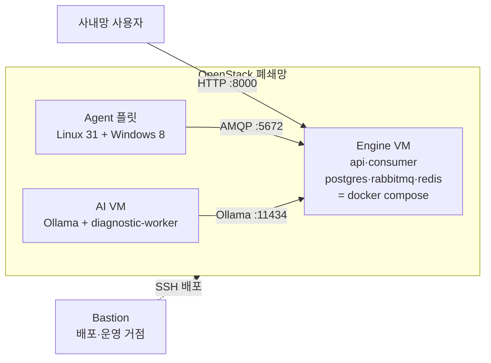
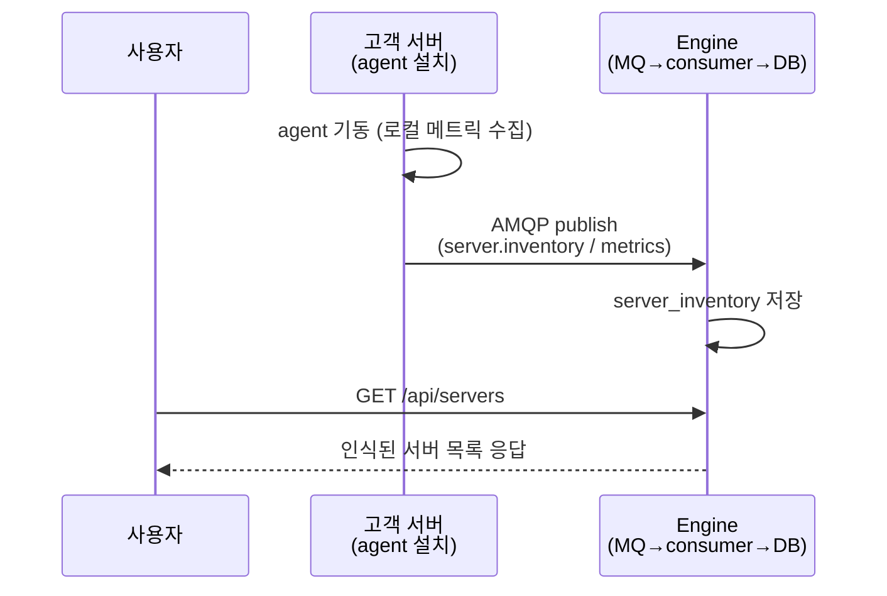
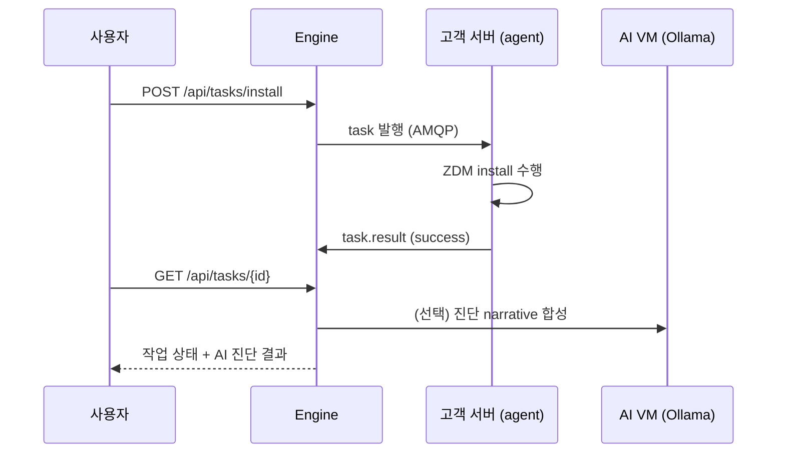
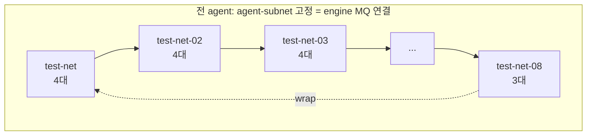
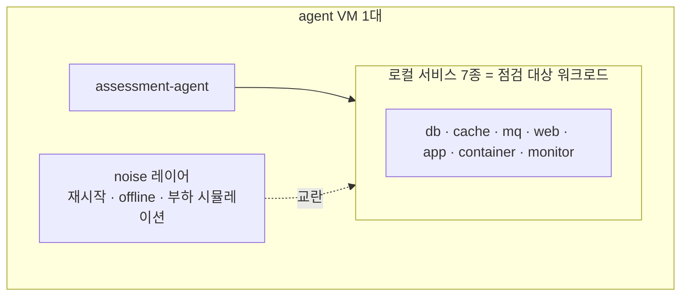
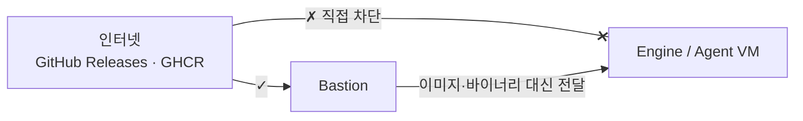
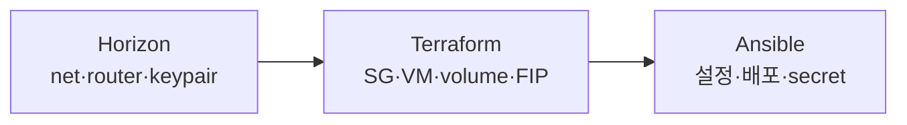

# Assessment 평가·진단 시스템
## 테스트 환경 구성 & 배포 아키텍처

발표자: taewon
2026-06-18 · 기술팀 내부 공유

> 상세 커버리지 매트릭스는 별첨 문서 참조
> (`agent-binary-image-coverage.md`)

---

## 1. 한눈에 보기 — 시스템 구조

<!-- 그림: 아래 mermaid를 PPT 다이어그램으로 옮김. 박스 4개 + 화살표 3종(HTTP/AMQP/SSH)만 -->

**핵심 메시지 (말로):**
- 우리가 만든 건 *기능 코드가 아니라* **배포 인프라** — engine repo의 이미지·바이너리를 OpenStack에 띄우는 환경
- VM 3종: ① 평가 엔진(1대) ② AI 진단(1대) ③ **점검 대상 시뮬레이션 = agent 플릿(39대)**

---

## 2. 고객 사용 시나리오 ① — 서버 인식

<!-- 그림: 시퀀스 다이어그램. agent 설치 → MQ 발행 → engine 저장 → 사용자 조회 -->

**말로:** agent 바이너리 하나 깔면 → 알아서 broker로 자기 자신을 보고 → 엔진이 인벤토리에 등록 → API로 조회.
고객 입장에선 "에이전트 설치 → 대시보드에 서버가 뜬다"

---

## 3. 고객 사용 시나리오 ② — 작업 발행(ZDM install)

<!-- 그림: 시퀀스. 사용자가 install 발행 → agent 수행 → 결과 조회. AI는 화살표 1개로 축약 -->

**말로:** 단순 모니터링이 아니라 **원격 작업 발행**까지. 작업 결과에 AI(LLM) 진단 코멘트가 붙는 게 차별점.

---

## 4. 테스트 환경 — 왜 39대인가

<!-- 표: OS 매트릭스 간략화. "왜 이 조합" 한 줄씩 -->

| 계열 | 커버 범위 | 대수 | 왜 |
|---|---|---|---|
| **Linux** | Debian·Ubuntu·Rocky·Alma·CentOS·Oracle·Amazon | 31 | 고객 서버 OS가 제각각 — 실측 커버리지 확보 |
| **Windows** | 2003 · 2008 · 2012 ~ 2025 | 8 | NT 버전별 바이너리 분기 검증 |

**축(why)이 3개:**
- **OS 종류** — 7개 Linux 배포판 + Windows 8세대
- **firmware** — 같은 OS도 **BIOS / UEFI 따로** (부팅·ZDM 동작 상이)
- **Python 버전** — py<3.7 OS는 정적 바이너리 수동 배포 경로 분기

> 빌드 매트릭스 추론이 아니라 **실제로 띄워서** MQ 발행·ZDM install 동작을 확인하는 게 목적

---

## 5. 테스트 환경 — 서브넷 토폴로지

<!-- 그림: 8개 서브넷 박스, 각 4대, 그룹 첫 대가 다음 서브넷으로 화살표(dual-homed/wrap) -->

**구조:**
- **primary NIC** = 전원 `agent-subnet` 고정 (engine MQ·bastion 연결, 필수)
- **secondary NIC** = 4대씩 8개 서브넷에 분산
- **dual-homed** = 각 그룹 첫 대는 인접 서브넷에도 연결 → 멀티 NIC·서브넷 간 통신 시나리오 검증

---

## 6. 테스트 환경 — 워크로드 시뮬레이션

<!-- 그림: agent VM 1대 안에 로컬 서비스 7종 + noise 레이어 스택 -->

**말로:** 빈 VM이 아니라 **실제 고객 서버처럼** DB·캐시·웹·컨테이너를 다 깔고, noise role로 장애·부하까지 흉내 → agent가 현실 조건에서 버티는지 검증

---

## 7. 왜 이 배포 구조인가 ① — 폐쇄망

<!-- 그림: VM은 인터넷 X, bastion만 O. bastion이 받아서 전달 -->

**제약 → 설계:**
- VM은 외부 인터넷 **직접 접근 불가** (폐쇄망)
- → bastion이 release 이미지·compose·바이너리를 **대신 받아** 전달 (`delegate_to: localhost` / `files/` 사전 복사)
- 현장 appliance도 같은 패턴 — 이미지 tar 동봉 후 `docker load`

---

## 8. 왜 이 배포 구조인가 ② — 핵심 결정

<!-- 표: 결정 3개 — 무엇을 / 왜 -->

| 결정 | 선택 | 이유 |
|---|---|---|
| **배포 모델** | docker compose 단일 스택 | 직접 설치 시 repo 차단(RabbitMQ·TimescaleDB) → 공식 이미지로 해소. 검증/현장 **같은 정의 공유** |
| **프로비저닝** | Terraform → Ansible 분리 | 자원(VM·SG·volume)은 선언적 IaC / VM 내부 설정·secret은 Ansible |
| **자동화** | release → 자동 배포 | engine release 발행 시 bastion runner가 `repository_dispatch`로 terraform+ansible 자동 실행 |

---

## 9. 검증 기준 & 현황

<!-- 표: 합격 기준 3종. 상세 결과는 별첨 -->

| 검증 항목 | 합격 기준 |
|---|---|
| **MQ 발행** | agent 기동 후 engine `server_inventory`에 신규 인식 |
| **ZDM install** | install 작업 발행 → agent 수행 → status `success` |
| **권한 모델** | 생성 유저 / sudo / systemd `User=` 기록 |

**알려진 예외 (by-design):**
- Windows ZDM install — 엔진 패키지가 Linux 전용 → 구조적 불가 (별도 지원 작업)
- RHEL 계열 — SELinux enforcing이 install.sh 차단 → permissive 적용 (ADR-0012)

> 📎 OS별 BIOS/UEFI 전수 결과 = **별첨 커버리지 매트릭스 문서**

---

## 10. 마무리 — 현황 & 남은 과제

**완료**
- ✅ OS 매트릭스·서브넷 토폴로지 확정 (Linux 31 + Windows 8)
- ✅ Terraform 모델·tfvars 작성, `validate` 통과
- ✅ engine v0.7.0 가동 중

**남은 작업**
- ☐ network 스택 apply → 서브넷 6개 생성
- ☐ agent 스택 apply → 39대 부팅
- ☐ 전수 배포 → MQ·ZDM 검증 → 매트릭스 기입

**감사합니다 / Q&A**
